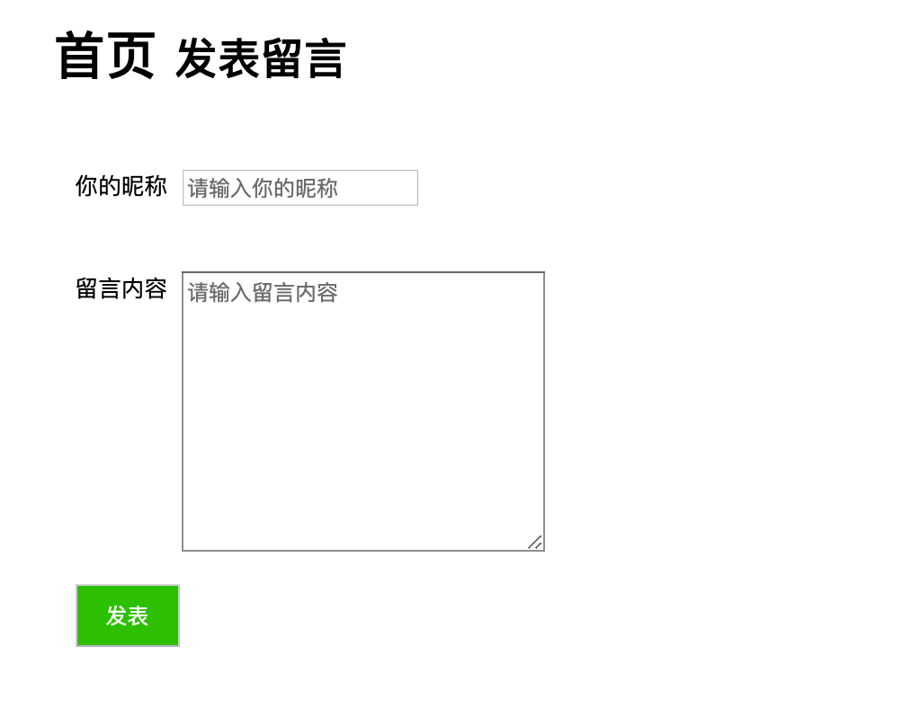

 使用node 实现一个留言板的功能




分类：node 练习

## Installation
```
cd feedback-server

npm install
```

## Start server
```
node app-http.js

//or
node app-express.js
```
 
- 使用node 的核心模块手动实习代码示例为 [app-http.js](./app.js)
- 使用express 实现 代码练习示例为 [app-express.js](./app-express.js)